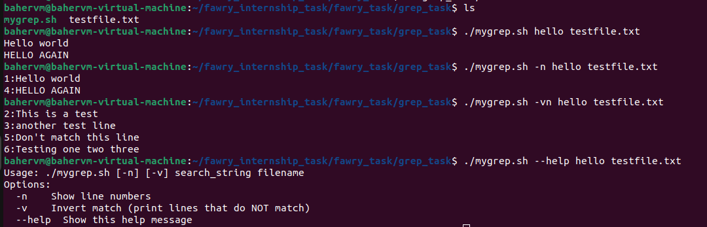

# mygrep.sh

A simple Bash script that mimics basic `grep` functionality.

## Features

- Search for a string (case-insensitive) in a text file.
- Options:
  - `-n` → Show line numbers for each matching line.
  - `-v` → Invert the match (print lines that do **not** match).
  - Combine options like `-vn` or `-nv`.
- Shows a help message with `--help`.
- Handles missing arguments and missing files properly.

## Usage

```bash
./mygrep.sh [options] search_string filename
```

## Options

- (-n): Display line numbers.
- (-v): Invert the match.
- (--help): Show usage instructions.

## Screenshot




## Notes

This script is executable -> chmod +x mygrep.sh
